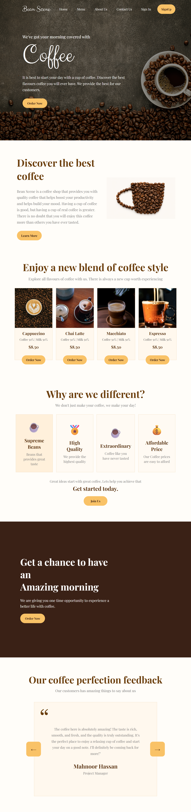

# ☕ Coffee Website

A modern and responsive **Coffee Website** built using **HTML, CSS, and JavaScript**. This project focuses on creating an attractive coffee-themed interface with a clean layout, engaging visuals, and interactive frontend elements.

## 🚀 Live Demo

🔗 **[View Live Website](ADD-YOUR-LIVE-DEMO-LINK-HERE)**

## 📸 Preview



> Replace `screenshot.png` with your actual website screenshot.

## ✨ Features

* ☕ Modern coffee-themed design
* 🏠 Responsive landing page
* 📱 Mobile-friendly layout
* 🍰 Coffee and product sections
* 📖 About section
* 📞 Contact section
* 🧭 Easy navigation
* ✨ Interactive frontend elements
* 🎨 Clean and visually appealing UI

## 🛠️ Technologies Used

| Technology     | Purpose                                         |
| -------------- | ----------------------------------------------- |
| **HTML5**      | Website structure and content                   |
| **CSS3**       | Styling, layout, animations, and responsiveness |
| **JavaScript** | Interactivity and dynamic functionality         |

## 📂 Project Structure

```text
Coffee-Website/
│
├── index.html
├── style.css
├── script.js
├── images/
│   └── ...
└── README.md
```

## 💻 Run Locally

### 1. Clone the Repository

```bash
git clone https://github.com/Mahnoor-Hassan/coffee-website.git
```

### 2. Open the Project

```bash
cd coffee-website
```

### 3. Run the Website

Open `index.html` in your browser.

No additional dependencies are required.

## 🎯 Project Goals

This project was created as a frontend practice project to improve my understanding of:

* Semantic HTML structure
* CSS layouts and responsive design
* JavaScript DOM manipulation
* Event handling
* Website navigation
* Creating visually appealing user interfaces
* Organizing frontend projects

## 🔮 Future Improvements

* 🛒 Add shopping cart functionality
* 💳 Add online ordering and checkout
* 👤 Add user authentication
* ⭐ Add customer reviews
* 📍 Add store location integration
* 📧 Add functional contact form
* 🌙 Add dark/light mode

## 👩‍💻 Author

**Mahnoor Hassan**

Software Engineering Student

🔗 [GitHub](https://github.com/Mahnoor-Hassan)

---

⭐ If you like this project, consider giving the repository a star!
